# 第一视角漫步与自由视角实现指南

本文对应：

- `src/experience/FreeCameraController.js`
- `src/experience/BeachExperience.js`
- `src/ui/UIController.js`
- `scripts/visual-check.mjs`

## 1. 为什么保留三种观察方式

OrbitControls 适合展示：用户围绕明确主体旋转和缩放，不容易迷路。第一视角漫步适合沉浸式
探索：相机保持正常人眼高度，沿沙面与木栈道行走。自由视角适合技美检查：它保留升降能力，
可以从空中观察构图、反射和模型关系。

项目没有创建三台相机，而是让同一台 `PerspectiveCamera` 在 OrbitControls 和一个指针锁定
控制器之间切换；指针控制器内部再选择 `walk` 或 `free` 运动策略。任意时刻只允许一套逻辑
更新相机，避免旋转、阻尼和目标点互相覆盖。

## 2. 输入到移动的完整数据流

```mermaid
flowchart LR
    A["keydown / keyup"] --> B["pressedKeys 输入状态"]
    B --> C["计算方向与冲刺倍率"]
    C --> D["指数阻尼得到 velocity"]
    D --> E["刷新 Camera Matrix"]
    E --> F["PointerLockControls 移动"]
    F --> G["WALK / FREE 运动策略"]
    G --> H["地表、岸线与空间边界"]
    H --> I["简化碰撞体解析"]
    I --> J["Renderer 绘制新视角"]
```



键盘事件不直接修改坐标。`keydown` 只把按键加入 `Set`，`keyup` 将其移除；真正的移动都在
动画帧中完成，因此同时按键、不同刷新率和短暂掉帧都更容易处理。

## 3. 帧率无关与指数阻尼

每帧位移必须乘 `deltaTime`：

```js
controls.moveForward(velocity.z * delta);
```

否则 144Hz 显示器会比 60Hz 移动得更快。速度平滑使用：

```js
const blend = 1 - Math.exp(-damping * delta);
velocity.z = THREE.MathUtils.lerp(velocity.z, targetSpeed, blend);
```

这种指数形式把“每帧靠近多少”转换为“每秒以多快收敛”，比固定 `lerp(..., 0.1)` 更能跨
帧率保持相同手感。

斜向移动前还会归一化 `W/A/S/D` 的二维输入，避免同时按两个方向时速度变成单方向的
`sqrt(2)` 倍。

## 4. Pointer Lock 的职责

Three.js 官方 `PointerLockControls` 负责鼠标朝向和浏览器指针锁定。本项目控制器只扩展：

- `W/A/S/D` 水平移动；
- `walk` 以 1.68 米眼高跟随地表，`Shift` 从行走切换为快跑；
- `free` 使用 `Space` 上升、`Q` 或 `Ctrl` 下降；
- `E` 交给探索玩法执行拾取，避免移动与交互共用同一按键；
- 速度阻尼与输入清理；
- 活动边界；
- 锁定超时、Promise 拒绝、窗口失焦和退出后的状态通知。

点击工具栏按钮后焦点会先回到 Canvas，再请求指针锁定。否则焦点可能仍停在按钮上，
键盘事件会被表单输入保护逻辑过滤。

Three.js r160 在内部 `isLocked` 更新前派发 `lock` / `unlock` 事件，因此事件回调里直接读取
该属性会得到相反的旧值。本项目改用 `document.pointerLockElement` 作为权威状态，并直接监听
`pointerlockchange`；这样 `Esc`、浏览器自动解锁、锁定失败和尚未完成的锁定请求都能回到同一
状态机，不会出现轨道模式下鼠标仍被锁住。

鼠标事件只更新 Quaternion，而 r160 的移动函数读取 `camera.matrix`。键盘移动前主动执行
`camera.updateMatrix()`，保证转向后的第一帧就沿新方向移动。

r160 的 `lock()` 还会忽略现代浏览器 `requestPointerLock()` 返回的 Promise。项目改为直接
请求平台 API：同步异常和异步拒绝都会进入同一错误路径；如果浏览器既不成功也不报错，
2.8 秒看门计时器会撤销 `LOCKING` 状态、恢复进入前的相机位置与 OrbitControls 目标，并显示原因。
锁定真正完成前不显示准星，也不接受移动，避免界面已经写着 `WALK/FREE`、操作却没有反应。

## 5. 贴地、边界、碰撞与轨道恢复

自由飞行先将水平位置和最高高度限制在 `THREE.Box3`，再使用与沙滩网格相同的
`terrainHeight(x, z)` 计算动态最低高度：

```js
camera.position.clamp(bounds.min, bounds.max);
camera.position.y = Math.max(
  camera.position.y,
  terrainHeight(camera.position.x, camera.position.z) + groundClearance,
);
```

`groundClearance` 是自由飞行相机到沙面的安全距离；海面区域仍受 Box3 的绝对最低高度保护。
两层约束共同防止相机钻入起伏沙地、飞出有效场景或越过远端雾区。

漫步模式每帧先完成水平移动和碰撞，再查询最终位置的表面高度。普通沙地直接读取
`terrainHeight(x, z)`；落在木栈道采样矩形内时，改用木板顶面。相机高度用指数阻尼跟随目标，
并叠加不超过 3.5 厘米的步态起伏；系统启用 `prefers-reduced-motion` 时会关闭起伏。动态岸线
根据 `x` 计算最小 `z`，让观察者可以接近湿沙，但不能继续走入反射海面。`Space/Q/Ctrl` 在
漫步模式中被明确忽略，因此它不会退化成低速飞行。

退出任一指针模式时，项目从当前相机朝向向前取一个观察点，并验证距离和极角是否满足
OrbitControls。边界朝向场外时，
改用指向场景内部的合法目标；这样只调整观察方向，不会为了满足最短轨道距离而把相机弹到
场景外。若锁定从未成功，则直接恢复进入指针模式前保存的位置与目标。

这一步不能简单保留旧 `controls.target`，否则用户自由飞行后切回轨道模式，相机会突然围绕
原来的木船旋转，产生明显跳变。

世界模块还为主船、躺椅、遮阳棚立柱、木栈道立柱、棕榈、较大礁石和灯柱生成 50 至 54 个
圆形或旋转盒碰撞体。相机使用半径 `0.42` 的简化体，只做二维推离和高度重叠判断：比逐三角形射线检测便宜，也足以避免
观察者穿过主要道具。碰撞法线会移除朝障碍物内部的速度，因此仍可沿斜放船体自然滑动。
到达 Box3 边界时同样清除向外速度，反向操作不再有短暂“粘墙”。

## 6. 设备与性能策略

漫步与自由视角仅在 `any-pointer: fine` 且支持 Pointer Lock 时显示，兼容带触屏和鼠标的混合
设备。移动端继续使用 OrbitControls，
因为触屏没有稳定的锁定指针语义，虚拟摇杆还会增加 UI 遮挡和额外测试面。

该功能不增加模型、贴图、光源或后处理，逐帧成本只有少量向量运算、一次解析地形采样和
边界钳制，
不会增加 Draw Call。真正需要关注的是第一人称相机能看到更大范围和更近的材质细节，因此现有视锥剔除、
阴影范围和远景完整性必须在不同位置复查。

首次进入场景会打开控制图。桌面端可从图中直接请求漫步或自由视角，移动端自动隐藏不可用部分；
关闭后只在本机记录一个版本化标记，右上角帮助按钮仍可随时重开。锁定成功后的按键带会
短暂出现再自动淡出，既帮助第一次使用，也不会长期遮挡画面。

## 7. 自动验收覆盖

`npm run test:visual` 会验证：

1. 首次引导在桌面和 390px 手机中完整显示、可关闭并可由帮助按钮重开；
2. 从引导直接进入漫步时 Canvas 获得 Pointer Lock，按钮、按键带与准星同步；
3. 漫步相机从木栈道入口开始，`W` 产生贴地位移；
4. 普通行走与冲刺距离有明确差异，`Space` 不会改变眼高；
5. 木栈道顶面覆盖沙地高度，动态岸线会阻止相机进入海水；
6. 浏览器解除 Pointer Lock 或按 `R` 后恢复 OrbitControls，速度和按钮状态归零；
7. 挂起请求显示 `LOCKING` 且无假准星，超时后恢复原位置与目标；Promise 拒绝不会产生未处理异常；
8. 无锁测试模式下独立验证自由飞行键盘、阻尼、三轴边界和边界速度归零；
9. 面向海玻璃按住 `E` 可以拾取，但相机不会同时上升；
10. 船体中心会把相机推出简化碰撞范围；
11. 边界退出指针模式时相机位置不跳，OrbitControls 目标保持合法；
12. 移动端隐藏两种指针模式，新场景仍满足 Draw Call 与三角形预算。

自动测试用 `document.exitPointerLock()` 稳定触发与 `Esc` 相同的浏览器
`pointerlockchange` 路径。人工验收仍应确认冲刺、升降和实际 `Esc` 手感。

## 8. 推荐改造练习

1. 分别调整 `walkSpeed`、`moveSpeed` 和两套阻尼，记录起步与停止差异。
2. 为边界增加可视化 Helper，只在开发模式显示。
3. 为步态增加很轻的横向摆动，并为 `prefers-reduced-motion` 保持关闭路径。
4. 在现有简化碰撞上增加台阶高度或胶囊体，比较手感与计算成本。
5. 将地表类型传给脚步音效或粒子反馈，区分沙地与木板。
6. 将相机速度写入水面或景深参数，比较交互与 Shader 联动的收益和成本。
