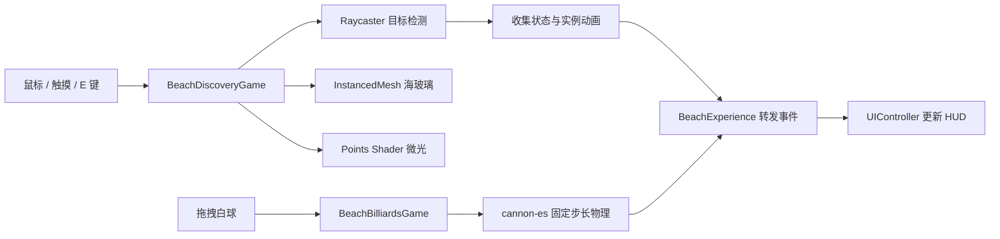

# 潮汐拾光与沙滩台球：玩法与场景迭代指南

本文记录从 2026-08-03 至 `0.41.0` 的场景与轻玩法迭代，适合从 JavaScript 基础继续学习
Three.js、Shader、物理引擎和实时项目结构。

0.40 细化近岸泡沫、草叶和沙地凹凸，保留本页所有玩法。原理与实际像素测试见 [近岸细节学习记录](NEAR_SHORE_FINISH_040.md)。

0.39 以水体画质为重点：共享 HDR 天空光照、分层光学、近岸覆盖率修复与更细反射，并整理 MIT/GitHub 发布检查。场景分区和玩法不变。方法、素材来源与尚未实现的写实特性见 [水体质感学习记录](WATER_QUALITY_039.md)。

当前画风为用户确认的柔和半写实海滨，共用配色、材质协调、环境光与后续素材接入规范见 [画风学习文件](COASTAL_ART_DIRECTION.md)。0.36 加入两位日常装 NPC；0.37 修复水面深度残留，调整休憩/活动/器材区与连接路线；0.38 让礁石湿润带和帆船高度跟随潮位，修复器材草丛穿插。台球规则和物理保持原样。[本轮学习文件](OCEAN_AND_NPC_GUIDE.md) 记录波形、深度折射、渲染状态 bug、空间布局、材质与植被衔接、对话任务状态、素材许可和测试方法。

0.41 将原六处玩法扩为三章、18 处，带退潮条件、图鉴、本机存档和徽记，同时细化草木、海鸥、游客和动态时间。当前规则以 [生态与玩法学习记录](LIVING_COAST_041.md) 为准，下文六枚海玻璃是第一章的历史实现。

## 1. 为什么选择收集探索

项目原本已经能观察、切换时间和自由漫游，但用户进入后没有明确的短期目标。玩法不能变成
独立小游戏，否则会破坏写实海岸的安静气质。因此选择“潮汐拾光”：在场景中寻找 6 枚海玻璃。

完整循环只有四步：

1. 任务 HUD 告知剩余数量；
2. 世界空间微光引导用户观察场景；
3. 环绕视角点击、移动端轻触，或漫步/自由视角靠近后按 `E` 拾取；
4. 全部找到后显示完成状态，并提供重新探索按钮。

这个循环很短，却让木船、礁石、漂流木、躺椅和沙丘从“装饰”变成探索地标。

## 2. 模块关系



- `BeachDiscoveryGame.js` 只负责玩法状态、射线检测和三维反馈；
- `BeachBilliardsGame.js` 负责台球输入、物理、落袋、计分和重置；
- `BeachExperience.js` 将玩法接入初始化、帧循环、画质切换和销毁流程；
- `UIController.js` 只消费事件，不直接访问 Three.js 对象；
- `world.js` 继续负责静态场景，不保存分数或 UI 状态。

这种分层能避免后续新增玩法时把大量判断塞进 `animate()`。

## 3. 一批目标为什么只需要两个绘制对象

如果每枚海玻璃都创建 Mesh、光晕 Sprite 和独立材质，六个目标可能增加十多个 Draw Call。
当前方案使用：

- 一个 `InstancedMesh` 绘制全部海玻璃；
- 一个 `Points` 绘制全部提示微光；
- `instanceColor` 为每枚玻璃提供颜色变化；
- 动态 `instanceMatrix` 控制聚焦放大、旋转、上浮和缩小；
- `aPhase`、`aVisible` 自定义 Attribute 控制每个点的闪烁相位与透明度。

片元 Shader 使用 `gl_PointCoord` 生成圆形核心和柔和光晕，不需要下载额外贴图。拾取时同一批
顶点向上移动并逐渐淡出，因此反馈不会额外创建粒子对象。

## 4. 三种输入如何共用一套 Raycaster

环绕视角将指针位置换算到 NDC 坐标：

```js
pointer.x = ((clientX - rect.left) / rect.width) * 2 - 1;
pointer.y = -((clientY - rect.top) / rect.height) * 2 + 1;
raycaster.setFromCamera(pointer, camera);
```

漫步与自由视角的指针被浏览器锁定，屏幕中心就是瞄准点，因此固定使用 `(0, 0)`。移动端触摸事件
仍然提供屏幕坐标，可以复用环绕视角路径。`Raycaster.params.Points.threshold` 扩大世界空间命中
半径，让远景目标不必做成夸张的大模型。

两种第一人称模式都只允许在 5.5 米内按 `E` 拾取。`E` 已从移动按键集合移除；自由飞行的
上升统一使用 `Space`、下降使用 `Q` 或 `Ctrl`，漫步模式忽略垂直输入，避免一次输入同时触发
移动和交互。

## 5. 场景质感升级

### 5.1 木栈道

栈道用 Catmull-Rom 曲线定义路线，木板与立柱分别使用 `InstancedMesh`，绳索合并为一个
Tube 网格。它从右侧前景指向木船和潮线，既增加近景尺度，也承担视觉引导。创建木板时还会
记录低成本表面采样，漫步相机经过时把眼睛高度抬到木板顶面，而不是穿过栈道贴着沙地走。

### 5.2 潮池

三个不规则圆形几何在创建阶段合并，使用低粗糙度、Clearcoat 和环境反射表现浅水。潮池只在
高画质显示，移动端把预算优先留给海面与交互目标。

### 5.3 风动沙丘草

旧草丛是三角锥轮廓。现在每簇由五片弯曲叶片构成，全部实例共用一个几何和材质。顶点 Shader
从 `instanceMatrix` 的平移分量得到相位，让不同位置的草以不同节奏摆动：

```glsl
grassPhase = instanceMatrix[3].x * 0.27 + instanceMatrix[3].z * 0.19;
transformed.x += sin(uGrassTime + grassPhase) * grassTip * 0.075;
```

`grassTip` 让根部保持稳定，只移动叶尖。这里体现了 Shader 相对逐对象 JavaScript 动画的优势：
CPU 每帧只更新一个时间 Uniform，成百上千个顶点在 GPU 上并行完成变化。

### 5.4 日光关系

日光预设提高太阳强度和曝光，降低云层与雾密度，并同步调整浅水、深水与沙色。天空、水面、
湿沙和 PBR 道具仍共享同一太阳方向，避免只把画面整体调亮。

### 5.5 遮阳休憩点与脚印

躺椅外增加了一个低面数遮阳棚。四根立柱和横梁在创建阶段合并为一个木材网格，条纹布面使用
CanvasTexture 生成，因此不依赖新增网络资源。立柱各有一个简化圆形碰撞体，第一视角不能直接
穿过棚架。

28 枚湿脚印使用一个 `InstancedMesh`，沿 Catmull-Rom 路线从栈道通往木船、漂木和潮池。
脚印既补充“有人活动过”的叙事，也以不发光的方式暗示探索方向。低画质不创建脚印，把移动端
预算留给水面和拾取目标。

### 5.6 沙滩台球与角色暂存

空旷干沙区新增一张沙滩台球桌，不移动木船、棕榈、栈道、休憩点或拾取物。玩家在环绕视角按住
白球并反向拖拽，松开后由 `cannon-es` 计算 16 个球体与 6 段库边的碰撞。6 个袋口负责落袋检测，
独立规则模块在每杆静止后判定球组、轮流、犯规和黑八胜负。HUD 提供自由球摆放与开球犯规选择，重置恢复完整球阵。详见 `BEACH_BILLIARDS_GUIDE.md`。

0.32.0 同时细化船体内舱、肋骨、躺椅布面与遮阳棚支撑，原有道具变换不变；建模过程见 `SCENE_MODELING_GUIDE.md`。

0.33.0 修复六段库边的错误 AABB，统一袋口模型与碰撞尺寸，加入高杆、低杆、左右加塞及可调台呢。进一步细化座板支撑/倒角、桨叶、椅框和棚布下摆；人物仍关闭。物理推导和测试记录见 `BILLIARDS_PHYSICS_GUIDE.md`，当前操作以 `BEACH_BILLIARDS_GUIDE.md` 为准。

0.34.0 继续强化模型结构：栈道铺板比例、底梁、柱帽、下垂扶绳和绑缚；船体封底落沙、舷侧分层、盘缆；躺椅转轴与卷布。模型变换与台球玩法保留，只有穿栈道的草移到路肩。建模测试为 `npm run test:models`，学习记录见 `SCENE_MODELING_GUIDE.md`。

0.35.0 改用经过筛选的 Poly Haven CC0 素材补充野餐区、冲浪器材区和自然细节，原 26 块岸石改为轻量纹理岩块。新增 `CoastalProps` 负责加载、实例化、碰撞绑定、反射分组和资源释放。素材来源、Blender 处理与实验步骤见 `COASTAL_ASSETS_GUIDE.md`，专项测试为 `npm run test:coastal`。人物继续关闭，台球规则与物理未改变。

台面、库边/桌腿、袋口、球和瞄准线共 5 个常驻绘制对象，平时只有 4 个可见。物理和渲染资源
首次进入场景时才加载，台球组排除在 Water 镜像通道之外，并在页面销毁时逐项释放。

“晴帽向导”和“软绒旅伴”的 `.blend`、`.glb` 和生成脚本继续保留，供后续收到最终角色模型后
复用接入流程。当前版本从 `BeachExperience` 移除了角色模块的导入、实例化和帧更新，运行时
调试状态为 `characters: null`，不会产生角色网络请求或渲染成本。

## 6. 性能结果

完整统计包含 Water 的镜像渲染：

| 档位 | Draw Call | 三角形 | 玩法绘制对象 |
| --- | ---: | ---: | ---: |
| Desktop High | 101 | 156,423 | 2 个拾光对象 + 4 个台球对象 |
| Mobile Low | 47 | 55,302 | 2 个拾光对象 + 4 个台球对象 |

桌面预算保持在 `112 Draw Calls / 165k Triangles` 内，移动端保持在 `56 / 64k` 内。新增几何后，
高画质地形采样从屏幕不可辨认的过密程度下调，把三角形留给真正能改善轮廓的草、栈道和道具。

## 7. 自动测试覆盖

`npm run test:visual` 现在会真实验证：

1. 初始任务数量和进度条；
2. 桌面鼠标点击目标；
3. 自由视角瞄准后按住 `E` 拾取，且相机不发生垂直位移；
4. 390px 移动端轻触拾取；
5. 六枚全部收集后的完成状态与重置按钮；
6. 重置后目标、HUD 和内部状态全部恢复；
7. 真实第一视角指针锁、贴地行走、冲刺、木板表面、岸线约束和 `Space` 不升空；
8. 风动草、栈道、遮阳棚、脚印、潮池、反射排除列表和实例数量；
9. 桌面与移动端 Draw Call、三角形、截图像素和文字溢出。
10. 台球的延迟创建、真实击球、目标球/白球落袋、计分、重置、对象复用与完整资源释放；
11. 人物运行时保持关闭，不发生模型请求、对象创建或帧更新。

## 8. 适合继续练习的方向

建议按风险从低到高推进：

1. 在 `DISCOVERY_SITES` 增加一个目标，观察实例数量和测试如何变化；
2. 为每个目标增加一句场景叙事，但继续让 UI 保持短小；
3. 用第二个 Attribute 控制不同颜色的拾取脉冲；
4. 将目标位置与涨潮/退潮状态联动，练习玩法和环境系统通信；
5. 增加可选计时模式，但保留当前无压力的默认探索；
6. 为沙滩中八增加击球录像回放或碰撞音效，保留已有规则；
7. 用真实低面数资产替换程序化台桌或躺椅，并重新测量网络体积、Draw Call 和三角形。

每次只改一个系统，然后依次执行 `npm run build`、`npm run test:visual` 和人工截图检查。这样能
明确知道画质提升来自哪里，也能知道它消耗了多少网页预算。
