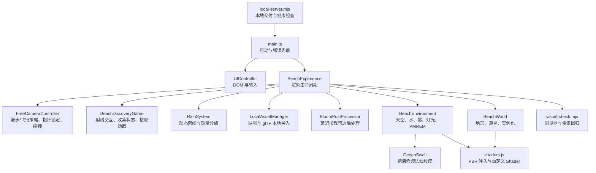

# 潮汐沙岸：整体制作流程与设计思路

> 项目定位：面向浏览器交付的写实向 Three.js 沙滩场景，同时作为技美方向的
> Shader、PBR、灯光与性能优化练习。
>
> 初始计划日期：2026-07-07  
> 本文整理日期：2026-08-03

## 1. 核心目标

项目不是单纯展示一个三维模型，而是完成一段可进入、可观察、可切换氛围的实时网页体验。
设计始终围绕四个目标：

1. **第一眼成立**：打开页面立即看到完整海岸，而不是先看大段产品介绍。
2. **写实关系成立**：天空、太阳、水面反射、湿沙和阴影遵循同一套光照逻辑。
3. **交互克制**：UI 只提供进入、时间、画质、探索目标和少量环境参数，不遮挡主体画面。
4. **轻量可玩**：用六枚海玻璃形成观察、寻找、拾取、完成的短循环，不破坏写实氛围。
5. **网页性能可控**：桌面表现材质细节，移动端主动降低材质、阴影和像素成本。
6. **空间可进入**：第一视角贴合沙地和木栈道，场景不仅能看，也能按真实尺度步行探索。

老师提供的 `D:\下载\boat.html` 只作为 Water/Sky 用法参考，项目在独立目录中实现，
不修改源文件。

## 2. 视觉设计思路

### 2.1 构图层级

默认镜头采用斜向海岸构图，让潮线成为贯穿画面的引导线。

- **前景**：木船、木栈道、救生圈、湿沙和散落贝壳，负责材质细节与故事性。
- **中景**：棕榈、礁石、躺椅和漂流木，建立比例与空间纵深。
- **远景**：帆船、海平线、云层和鸟群，避免背景成为空白色带。

主体不放在正中央。木船位于右下视觉区域，海岸线从左侧向右侧延伸，给用户旋转视角时
留下可探索空间。

### 2.2 色彩关系

场景不是一套颜色整体变暗，而是分别控制天空、光源、雾、水、沙和泡沫：

| 时段 | 主光 | 天空与雾 | 沙滩 | 水面 | 情绪 |
| --- | --- | --- | --- | --- | --- |
| 日光 | 暖白高角度太阳 | 青灰、通透 | 浅金色 | 青绿浅水、灰蓝反射 | 清爽 |
| 黄昏 | 低角度橙光 | 粉橙与灰紫 | 暖棕、长阴影 | 暖反射与冷深水 | 戏剧性 |
| 月夜 | 冷蓝方向光 | 深蓝黑、星点 | 低饱和冷灰 | 月光高光 | 安静 |

`ACESFilmicToneMapping` 负责高光压缩，曝光值随时段变化。黄昏和夜间仍保留环境补光，
避免礁石、船体和植被变成纯黑剪影。

### 2.3 参考项目的转化

参考 Lumen Decor Studio 的不是具体模型或版式，而是三种体验原则：

- 首屏直接呈现可运行的三维空间；
- `START` 之后才开放完整交互；
- `Time of Day` 成为主要体验开关。

本项目将室内产品展示逻辑转化为海岸环境展示：时间切换不只改背景色，而是同时驱动
太阳高度、光色、天空散射、水面反射、湿沙颜色、泡沫色、月亮、星空和灯光。

## 3. 技术架构



模块职责保持单一：

- `BeachExperience.js`：Renderer、Camera、三种视角模式、画质和帧循环。
- `FreeCameraController.js`：Pointer Lock 状态机、贴地漫步/自由飞行策略、阻尼、超时恢复和边界。
- `BeachDiscoveryGame.js`：收集目标、Raycaster 输入、实例动画与玩法事件。
- `BeachBilliardsGame.js`：拖拽击球、cannon-es 物理、落袋计分和台球资源生命周期；台球 HUD
  通过 `BeachExperience.focusBilliards()` 复用环绕镜头补间，并为桌面和手机选择独立构图距离。
- `world.js` 的动态碰撞登记：复用已有盒碰撞解析器，并在画质重建后恢复台桌边界。
- `RainSystem.js`：单 Draw Call 立体雨幕、相机跟随和高低画质密度。
- `LocalAssetManager.js`：本地文件校验、展示、规格化、动画和资源释放。
- `BloomPostProcessor.js`：可选 Composer 链、画质参数、尺寸同步和 GPU 资源释放。
- `OceanSwell.js`：在 Three.js Water 片元 Shader 中注入远海解析法线坡度和近岸淡出。
- `environment.js`：所有随时间变化的环境系统。
- `world.js`：沙滩地形、道具生成、实例批次、简化碰撞体和局部动画。
- `shaders.js`：材质工厂、GLSL 和程序化法线。
- `UIController.js`：DOM 状态、首次操作引导、面板、全屏和参数输入。
- `visual-check.mjs`：桌面/移动端的自动验收。
- `local-server.mjs`：生产成品的后台 HTTP 服务、健康检查、端口回退和安全停止。

## 4. 从零到成片的制作流程

### 阶段一：需求拆解与源文件隔离

1. 阅读课程模板与老师提供的 Water 示例。
2. 明确必须保留的课程技术点：Three.js、Water、Sky、OrbitControls。
3. 新建独立 Vite 项目，避免在老师源文件上直接堆功能。
4. 定义交付边界：浏览器直接访问、桌面可交互、移动端可运行。

验收：项目可独立启动，原始 `boat.html` 的时间与内容均未变化。

### 阶段二：灰盒与坐标规范

1. 先确定世界坐标：`Y` 向上，海岸沿 `X` 展开，海水位于较小的 `Z`。
2. 用解析高度函数生成沙滩，而不是手动摆一个完全平坦的平面。
3. 所有地面物体通过同一个 `terrainHeight(x, z)` 获取高度。
4. 先用简单几何确认镜头、比例、遮挡和潮线位置，再做材质。

验收：船、礁石和植被不漂浮、不穿地，默认镜头具有前中远景。

### 阶段三：天空、水与统一光向

1. 用 `Sky` 的 turbidity、rayleigh、mie 参数建立大气散射。
2. 将太阳球面角度转换为方向向量。
3. 同一方向同时传给 Sky、DirectionalLight 和 Water。
4. 用独立 Sky 场景生成 PMREM，作为 PBR 材质的环境反射。
5. 在项目自己的 Water 实例上局部扩展近岸 Fresnel、浅水散射、深水吸收、
   地平线反射染色和太阳高光，不修改 Three.js 模块或老师文件。
6. 将反射强度、高光强度、浅水色和深水色放入时段预设，让日光、黄昏和月夜
   共享同一套连续插值。

验收：太阳方向变化时，天空亮区、物体阴影和水面高光方向一致。

### 阶段四：材质分层与 Shader

材质遵循“先定义物理属性，再添加视觉变化”的顺序。

1. **沙滩**：先设置干沙粗糙度，再按世界坐标混合湿沙和水下沙。
2. **湿沙**：降低 Roughness，桌面端增加 Clearcoat 和程序化微法线。
3. **浅水**：在水下沙地加入低强度动态焦散，受 daylight 控制。
4. **礁石**：叠加岩层、细噪声、低位湿润和朝上苔藓。
5. **木材**：局部坐标生成木纹；船漆使用覆盖、剥落和划痕遮罩。
6. **植被**：顶点色控制根部到叶尖变化，背面微发光近似透光。
7. **泡沫**：独立 ShaderMaterial 生成主浪线和回流细线；网格用平滑上包络连接
   `terrainHeight()` 与海平面，并把透明端帽放在构图之外。
8. **云层**：CPU 启动时生成可平铺密度图，GPU 每帧只采样两次并漂移。

沙地大尺度颜色变化混合两组不同旋转角度的 Value Noise，避免单一 UV 网格在
低角度镜头下显出方格。近岸泡沫在陆侧贴合地形、入水后略高于海平面，交界处使用
圆滑上包络，避免透明网格被深度缓冲裁切或在低角度露出硬折痕。

验收：关闭颜色变化后仍能从 Roughness、高光和法线判断材质差异。

### 阶段五：道具与场景叙事

1. 木船作为前景主角，救生圈提供高饱和焦点。
2. 礁石靠近潮线，材质湿润遮罩因此有合理空间依据。
3. 棕榈和躺椅建立“有人活动过”的痕迹。
4. 远帆、鸟群、贝壳、草和漂流木补足尺度信息。
5. 夜间灯柱只在月夜增强，形成冷暖对比。
6. 木栈道、条纹遮阳棚和湿脚印建立从入口到潮线的可行走叙事路线。

验收：移除任一类道具时，能说明它在构图、尺度或叙事中的作用。

### 阶段六：时间系统

每个时段是数据预设，不在 UI 事件中直接逐项改材质。点击按钮后：

1. `BeachEnvironment` 设置目标预设；
2. 数值使用指数平滑插值；
3. Color 对象原地 `lerp`，不在帧循环中创建新对象；
4. PMREM 延迟到切换开始后更新一次；
5. World 接收统一 atmosphere 状态，更新沙、泡沫与灯光。

天气层复用同一条指数平滑链，以中性晴朗参数叠加多云或阴天参数，不复制时段控制代码。

### 阶段六点五：动态潮位

潮位不是单独移动一个水面，而是一个由 `BeachEnvironment` 管理的共享标量。低潮为
`-1`，中潮为 `0`，高潮为 `1`；自动模式用 180 秒正弦周期生成目标值，再用指数平滑
消除切换跳变。同一潮位同时驱动：

1. Water 的垂直高度；
2. 沙材质的 `uShoreline` 湿沙分界；
3. 泡沫网格的岸线位置；
4. 漫步控制器的动态涉水边界。

每帧只传递数值并原地修改已有对象，不创建材质、几何体或临时状态对象，因此不增加
Draw Call。质量档重建陆地世界后，环境模块会立即重新应用当前潮位。

### 阶段七：UI 与交互

1. Intro 覆盖在实时 Canvas 上，加载完成后开放 ENTER。
2. 进入后启用 OrbitControls，Intro 淡出，HUD 淡入。
3. 首次进入显示自适应操作图，帮助图标可随时重开；桌面可直接进入漫步或自由视角。
4. 桌面端可在 `ORBIT / WALK / FREE` 间切换，Orbit 与指针控制器始终互斥。
5. 漫步与自由视角共用 Pointer Lock 状态机，内部按模式选择贴地或三轴运动策略。
6. 漫步从木栈道入口开始，跟随解析沙地和木板表面，动态岸线阻止观察者走入海水。
7. 键盘意图由 `deltaTime` 和指数阻尼更新速度；步态起伏遵守 `prefers-reduced-motion`。
8. 锁定请求分为 `LOCKING / LOCKED / ERROR`，挂起、拒绝和浏览器解锁都有明确恢复路径。
9. 相机受空间边界、解析地形与简化道具碰撞共同限制，撞墙后清除向外速度。
10. 退出时先验证 OrbitControls 目标；场景边界使用内部目标，避免相机为满足最短距离而瞬移。
11. 图标按钮负责重置、漫步、自由视角、帮助、信息、设置和全屏。
12. 时间使用分段控件，数值参数使用 Range，阴影使用 Toggle。
13. 移动端隐藏依赖 Pointer Lock 的两种模式和次要信息，并将侧栏变为底部面板。

验收：桌面和 390px 宽度下无文字溢出；按钮可聚焦并有可读标签。

### 阶段八：性能优化

优化顺序是“先测量，再减少重复工作”：

1. 像素比上限：桌面 `1.75`，移动端 `1.0`。
2. 阴影：桌面 2048，低画质 768，并限制阴影相机范围。
3. Water 反射：桌面 512，移动端 256。
4. 移动端不构建程序化岩石/木材 Shader，也不启用 Physical Clearcoat。
5. 运行时切档只重建陆地 World，真正替换材质与几何，同时保留 Water 和当前时段。
6. 礁石由 26 个 Mesh 合并为 3 个实例批次。
7. 55 片叶、40 段树干、20 个椰果分别合为 1 个实例批次。
8. 救生圈白带、船内座板和躺椅木框在创建阶段烘焙变换并合并几何。
9. 贝壳、石子和草本来就使用实例化。
10. 接触遮蔽使用一批透明贴片，作为移动端实时阴影的低成本补充。
11. Water 镜像相机跳过沙地、石子、贝壳、草和接触遮蔽等无收益内容。
12. `renderer.info` 每帧手动重置，使主视图与镜像渲染被完整统计。
13. 预览镜头、昼夜插值和实例动画复用临时数学对象。
14. 页面卸载时统一释放事件、纹理、几何、材质、PMREM 和 Renderer。
15. 六枚海玻璃合并为一个 `InstancedMesh`，提示微光合并为一个自定义 `Points` Shader。
16. 460 簇高画质沙丘草共用一份叶片几何，顶点 Shader 根据实例位置错开风摆相位。
17. 木栈道木板和立柱分别实例化，潮池合并为一个透明 PBR 网格。
18. 高画质地形采用低于屏幕像素密度的采样，给玩法与场景道具预留三角形预算。
19. 28 枚湿脚印使用一个实例批次；低画质不创建该批次。
20. 遮阳棚四根立柱与横梁合并为一个网格，布面为第二个网格，程序化贴图无网络请求。
21. 新增脚印和遮阳棚均从 Water 镜像相机排除，避免在低收益反射中重复绘制。
22. 用异步 WebGL2 Timer Query 测量 Water 镜像与主视图的完整 GPU 时间；查询结果未就绪时不等待。
23. 自动画质在 5 秒窗口同时参考平均 FPS 与平滑 GPU 耗时；扩展不可用时保留 FPS 兜底。

当前默认镜头完整帧统计（包含 Water 镜像渲染）：

| 档位 | Draw Call | 三角形 | Shader 路径 |
| --- | ---: | ---: | --- |
| 桌面 High | 约 95 | 约 138,500 | Physical 沙、程序化岩石/木材、风动草、分层水与云 |
| 桌面 Low | 约 55 | 约 54,000 | Standard 岩石/木材、简化地形与装饰 |
| 移动端 Low | 约 53 | 约 54,000 | Standard 岩石/木材、低分辨率反射与阴影 |

自动回归上限设置为桌面 `100 / 140k`、移动端 `55 / 55k`。新增内容超过预算时，
测试会直接失败，迫使后续功能说明其成本。

### 阶段九：视觉与工程验收

每轮修改后执行：

```bash
npm run build
npm run test:server
npm run test:gpu
npm run test:visual
npm audit
```

`npm run test:visual` 默认会临时启动隔离的 Vite 服务并在结束后关闭；设置
`TIDELINE_URL` 时则可复用同一套断言验收部署产物。

视觉回归会检查：

- 页面无 Console/Page Error；
- Canvas 不是空白或单色；
- Water 时间 Uniform 持续前进，深浅水颜色、反射与太阳高光参数有效；
- 桌面与移动端选择正确画质；
- Shader 管线、实例数量和灯光状态符合预期；
- 首次操作图可关闭、重开并按设备隐藏不可用操作，所有文字保持在视口内；
- 真实 Pointer Lock 下可进入漫步/自由视角、转向、移动并正确解锁，挂起/拒绝能自动恢复；
- 漫步贴合沙地与木栈道，冲刺更快，`Space` 不升空，动态岸线阻止继续走入海面；
- 指针相机不穿主船或棚架，边界清除外向速度，退出后相机、轨道目标与 UI 状态正确恢复；
- 鼠标点击、第一人称 `E` 键和移动端触摸均能拾取目标，六枚完成与重置形成闭环；
- `E` 只执行拾取，不会同时触发自由视角上升；
- 移动端不暴露依赖指针锁定的控制；
- 日光、黄昏与月夜亮度确实不同，黄昏保留暖光与冷水的色温分离；
- 可见按钮无横向或纵向文字溢出；
- Draw Call 与三角形不超过预算。
- GPU 查询队列有上限、结果有效，扩展不可用时正确退回 FPS 判断。

自动测试之后仍需人工查看日光、黄昏、月夜和移动端截图。像素统计无法判断云形是否自然、
主体是否被遮挡或高光是否具有审美质量。

### 阶段十：稳定本地交付

生产构建结束后，`prepare-dist.mjs` 会把纯 Node 本地服务器、一键启动/停止脚本和使用说明
复制到 `dist`。启动器在后台运行服务并写入健康状态，命令窗口关闭后网页仍可访问；再次启动
时先验证并复用已有进程。默认端口冲突时自动回退，实际地址由启动器直接打开。

静态服务仅监听本机回环地址，并实现正确的 MIME、HEAD、ETag、Range、前端路由回退和
目录穿越拦截。这样 `dist` 可以直接作为网页成品压缩包，不再要求接收者手动输入 Vite 命令。

### 阶段十一：可选雨幕与本地资源

雨幕用动态 `LineSegments` 维护三维下落体积，高画质 1100 条、低画质 520 条，只在开启时
更新并增加 1 个 Draw Call。雨幕进入 Water 反射排除列表，防止镜像通道重复绘制。

本地导入保持“一次一个资源”的受控边界。贴图进入独立展示板，GLB/内嵌 glTF 经解析后统计
复杂度、关闭自带灯光、统一缩放并贴合沙地。`GLTFLoader` 使用动态导入，模型功能没有被使用时
不会请求解析器分包。移除和页面卸载都会释放几何、材质、贴图、ImageBitmap 与动画。

### 阶段十二：独立天气氛围

天气不是第四个时段，也不自动开启雨幕。`BeachEnvironment` 保留日光、黄昏、月夜的原始
状态，再叠加晴朗、多云、阴天三档天气状态。晴朗档的全部乘数为 `1`、覆盖量为 `0`，保证
默认画面不变；多云和阴天平滑调整云层覆盖、主光、环境补光、指数雾、曝光、水面反射与太阳高光。

天气切换只修改已有 Uniform、Light、Fog 与 Renderer 属性，不创建几何体、材质或额外渲染通道。
自动回归会验证天气与雨幕相互独立，并比较三档状态的变化方向和渲染统计。

### 阶段十三：海浪与岸线泡沫联动

Water 的 `time` uniform 是唯一波浪时钟。`BeachEnvironment` 按海浪速度累积该值，再把同一数值
传入 World 和泡沫 Shader 的 `uWavePhase`。泡沫保留原有多尺度噪声，只让主浪线随相位推进、
展宽和回撤，并让回流水线反相增强。这样调节海浪速度时，水面与岸边不再使用两套节奏。

相位只更新已有 uniform，不重建泡沫网格。高低画质共享同一行为，约 `0.91m` 的最大推进范围
也不会改变潮位决定的整体岸线位置。自动回归分别测量 `1.20` 与 `0.20` 速度下的相位增量，
并要求 Water 时间、泡沫 uniform 和调试状态保持一致。

### 阶段十四：GPU 帧计时与自动画质

`GpuFrameTimer` 使用 `EXT_disjoint_timer_query_webgl2` 的 `TIME_ELAPSED_EXT` 查询包围完整
`renderer.render()`，因此结果同时包含 Water 镜像通道与主视图。每帧只检查较早查询的
`QUERY_RESULT_AVAILABLE`，未就绪时立即返回，不通过读取结果强迫 CPU 等待 GPU。

查询队列最多保留 4 项，超过 120 帧仍未完成的查询会被回收；驱动报告 `GPU_DISJOINT_EXT`
时清空全部无效样本并重新积累。WebGL 上下文丢失时停止查询，恢复后重新获取扩展。

自动画质仍使用一次 5 秒观测窗口。高画质下平均 FPS 低于 `42`，或至少获得 12 个有效样本
且平滑 GPU 时间超过 `20ms`，都会只向 Low 降级一次。调试状态记录即时/平滑毫秒、样本数、
队列、disjoint、丢弃和降级原因。扩展不可用时这些值保持空并仅使用 FPS，场景内容不变。

### 阶段十五：清晨薄雾预设

清晨继续复用 `PRESETS` 的完整字段结构，不增加特殊分支。`7.5°` 低角度太阳提供暖色主光，
Sky 的 turbidity 与 Mie 参数柔化大气，`FogExp2` 密度从日光的 `0.00108` 提高到 `0.0034`，
使近景船和栈道保持可读，远海与天空交界逐渐消隐。

同一预设还同步改变 Water 地平线/深水色、反射、高光、云层色、干湿沙和泡沫。天气仍作为
中性层叠加在时段之上，因此清晨可继续组合晴朗、多云或阴天，且不会联动雨幕、潮位或玩法。
时间控件增加第四段“清晨”，但默认激活项仍为“日光”，原始首次画面不变。

桌面与移动端回归都会点击真实按钮、检查状态和渲染预算，并保存独立清晨截图。该预设只更新
已有颜色、标量与 uniform，不增加物体、Draw Call、三角形、纹理或依赖。

### 阶段十六：可选地表脚步声

`FootstepAudio` 在默认关闭时不创建 `AudioContext`。用户点击设置开关后才初始化 Web Audio，
并按漫步相机的实际水平位移累计步距。只有 `walk` 模式且控制器确认贴地时才触发；停止、
离地、切换视角和瞬移都会清空未完成步距。

地表类型复用木栈道现有的表面采样，不新增碰撞或射线检测。沙地使用低通衰减噪声，木板使用
带通短噪声叠加三角波，均由一次性节点程序化合成。该功能没有外部音频文件、网络请求、纹理、
Draw Call 或三角形成本，并通过假音频上下文测试和真实浏览器开关回归验收。

### 阶段十七：持久化构图书签

构图书签提供 3 个槽位，只保存 camera position 与 OrbitControls target。`CameraBookmarks` 负责
槽位范围、有限数值、坐标上限和格式版本校验，并在读写边界复制数组；损坏 localStorage 数据
不会进入相机，存储不可用时退化为本次页面内存状态。

恢复书签先退出漫步或自由视角，再复用重置镜头已有的三次缓入缓出过渡，同时插值位置与观察
目标。整个过程不修改时段、天气、潮位、画质、玩法或导入资源，也不增加场景对象、Draw Call、
三角形和 GPU 成本。桌面与移动回归都覆盖保存、移开、恢复、空槽和删除。

### 阶段十八：低频远海涌浪

Water 原有法线贴图负责细碎波纹，远海则在同一个片元 Shader 中追加两组方向、频率和速度不同的
解析正弦坡度。两组坡度共同写回 `surfaceNormal`，复用 Water 的 `time` uniform，因此“海浪速度”
仍是唯一时间源，不会出现第三套独立节奏。

强度通过 `uSwellStrength` 控制，默认 `0.42`。`worldPosition.z` 在 `-72` 到 `-12` 之间形成平滑遮罩，
远海完整显示，近岸逐渐归零。该实现只改变反射与高光的法线方向，不做顶点位移，所以潮位、水面
高度、船只、玩法目标和漫步碰撞保持不变；也不增加几何、纹理采样、Draw Call 或运行依赖。

自动验收会冻结动画和 Water 时间，分别以强度 `0` 与 `1` 渲染同一帧，要求桌面和移动端都出现
足够的像素变化，同时逐项确认 uniform、近岸淡出、时间源以及 Draw Call/三角形预算不变。

### 阶段十九：延迟加载柔光泛光

项目已有完整帧 GPU Timer Query，桌面 High 实测存在足够余量后才加入可选后处理。默认关闭时
仍调用 `renderer.render(scene, camera)`，并且不请求任何后处理分包、不分配 Composer RenderTarget，
因此首次画面、默认 Draw Call 和 GPU 内存路径保持不变。

首次开启后动态加载 `EffectComposer`、`RenderPass`、`UnrealBloomPass` 与 `OutputPass`，以高亮阈值
只柔化月亮、灯柱、海玻璃和水面反射。High 使用 `0.32 / 0.22 / 0.84` 的强度、半径、阈值，
Low 使用 `0.22 / 0.16 / 0.90`；画质和视口变化会同步更新参数、像素比与 RenderTarget 尺寸。

Composer 渲染仍位于原有 GPU 查询 begin/end 之间，因此自动画质看到的是 Water 镜像、主场景和
后处理的完整成本。关闭后立即恢复直接渲染，已加载链保留以支持无卡顿再次开启；页面卸载时释放
Bloom 各级纹理、Pass 材质和 Composer 双缓冲。浏览器回归冻结月夜同一帧比较开关像素，并确认
关闭后 Draw Call、三角形和 Points 恢复基线。

### 阶段二十：统一海风状态

原有云层 Shader、草地 Shader、棕榈叶实例矩阵和雨丝线段分别使用写死的风速与时间。新建
`CoastalWind` 后，四者改读同一份每帧状态：目标强度、平滑后的有效强度、倍率、累积相位和
雨丝 X/Z 漂移。状态对象在帧循环中复用，不产生持续垃圾回收压力。

强度 `0.60` 映射为原有 `1x` 效果，因此默认场景不变；`0.00` 冻结云层相位并让植被和雨丝归于
静风，`1.20` 则统一达到 `2x`。用户输入通过指数缓动过渡，自动测试可即时定位到目标值。

云层和草地继续只更新已有 uniform，55 片棕榈叶继续共享一个动态 InstancedMesh，雨幕继续写入
原有 DynamicDrawUsage position buffer。浏览器验收冻结相机和水面，逐项比较云层时间、草地幅度、
首组棕榈实例矩阵、雨线倾角与渲染统计，并保存桌面和移动端静风/强风截图。该功能不增加对象、
Draw Call、三角形、纹理、网络资源或依赖。

### 阶段二十一：程序化云层运行时画质分级

原有质量切换会重建 World 并调整阴影、像素比、雨幕和后处理，却不会替换页面启动时创建的
程序化云层。桌面切 Low 后仍保留 `512×256` 密度纹理和 `48×24` 云穹分段，移动设备切 High
也仍使用 Low 资源，按钮状态与真实 GPU 资源不一致。

`CloudQuality` 现在集中定义两档规格：High 为 `512×256`、5 Octave、2208 个云穹三角形；Low
为 `256×128`、4 Octave、728 个三角形。Low 的纹理面积减少 75%，云穹三角形减少约 67%，
Shader、两次纹理采样和单个 Mesh Draw Call 保持不变。

切档时先创建目标云层，再复制当前相位、旋转、透明度、天气颜色和太阳方向，替换 Scene 引用后
分别 dispose 旧 Geometry、Material 与 Texture，并清理 renderer render lists。浏览器回归监听三类
资源真实的 dispose 事件，验证 High → Low → High 双向切换、动画连续性和 revision；移动端验证
首次创建即为 Low 且无多余替换。

### 阶段二十二：Water 反射 RenderTarget 画质分级

原有 Water 只在页面启动时按初始画质创建 `512×512` 或 `256×256` 镜像目标。运行时切档虽然会
更新像素比、阴影、World、雨幕、后处理和云层，Water 私有闭包中的 RenderTarget 却仍保持启动
尺寸，导致界面档位和真实 GPU 资源不一致。

`WaterReflectionQuality` 集中定义 High `512×512` 与 Low `256×256` 两档。环境在首帧 Water
镜像渲染中识别与 `mirrorSampler` 相连的目标，之后对同一 RenderTarget 调用 `setSize()`。Low
像素面积减少 75%，Water Mesh、Material、纹理对象、Shader 注入和 Draw Call 数量保持不变。

High → Low → High 切换不会重建 Water，因此累积时间、远海涌浪相位、潮位、天气反射和岸线节奏
连续保留。调试状态公开尺寸、像素、revision、resize 次数和对象身份；浏览器回归监听缩放产生的
旧附件释放，并在页面销毁时确认最终 RenderTarget 显式释放和引用清空。

### 阶段二十三：Water 法线贴图运行时画质分级

本地 `water-normal.jpg` 为 `512×512`。原有加载流程会在 High、Low 和移动端都直接上传这张图，
运行时切档也不替换 Water 的 `normalSampler`，所以 Low 档仍保留完整纹理与 8× 各向异性。

`WaterNormalQuality` 现在定义 High `512×512 / 8×` 与 Low `256×256 / 4×`。本地图片作为只读源
保留；High 直接使用源尺寸，Low 通过 Canvas 2D 高质量缩小。图片不可用或缩放失败时，按同一目标
尺寸生成程序化 DataTexture，避免质量规格在回退路径失效。

切档先创建并绑定新纹理，再 dispose 旧活动纹理。Water、Material、镜像目标和源图身份保持稳定，
因此时间、涌浪、潮位、天气和 Shader 状态连续。Low 像素面积减少 75%，Draw Call、三角形和
Shader 采样次数不变。浏览器回归验证 High → Low → High 的尺寸、UUID、源图复用、旧纹理释放，
并确认页面销毁时活动纹理和源纹理各释放一次。

### 阶段二十四：程序化月面运行时画质分级

月面 CanvasTexture 原本只在环境初始化时按启动档位生成。桌面 High 切 Low 后仍保留 `256×256`
与 46 个陨石坑，移动端 Low 切 High 后仍停在 `128×128` 与 23 个陨石坑，真实 GPU 资源和界面
档位不一致。

`MoonQuality` 现在集中定义 High `256×256 / 46` 与 Low `128×128 / 23`。切档先生成确定性的目标
CanvasTexture，再更新原 MeshBasicMaterial 的 map，最后 dispose 旧纹理。Low 像素面积减少 75%，
Draw Call、几何和 Shader 采样数量不变。

月球 Mesh、Material、位置、透明度、颜色与昼夜状态全程复用。调试状态公开纹理尺寸、陨石坑、
revision、释放次数和三类 UUID；浏览器回归验证 High → Low → High 双向切换、移动端首次 Low、
对象身份稳定、旧纹理释放，以及页面销毁时最终纹理释放和 map 清空。

### 阶段二十五：程序化月球几何运行时分级

月面纹理完成分级后，球体仍固定使用 `28×20` 分段。Low 虽然已减少 75% 纹理像素，却继续保留
High 的 609 个顶点和 1,064 个三角形，纹理档位与真实几何复杂度没有一起变化。

`MoonQuality` 现在同时定义球体分段：High 保留 `28×20 / 609 顶点 / 1,064 三角形`，Low 使用
`18×12 / 247 顶点 / 396 三角形`，三角形减少约 63%。月球仍是同一个 Mesh、同一个 Material 和
同一个 Draw Call，尺寸、位置、月夜透明度、昼夜过渡和场景构图不变。

切档时先创建目标 CanvasTexture 与 SphereGeometry，再一次性更新原 Mesh 的资源引用，最后分别
dispose 旧 Texture 和 BufferGeometry，并清理 renderer render lists。调试状态公开真实分段、顶点、
三角形、资源 UUID 和释放次数；浏览器回归监听两类资源真实的 dispose 事件，覆盖桌面双向切档、
移动端首次 Low 和页面退出时最终资源释放。

### 阶段二十六：星空运行时分级与白天天体剔除

原有星空固定创建 950 个点，桌面 High、Low 和移动端都上传同一份位置缓冲；清晨与日光虽然把
星空、月球和月晕透明度降到 0，三个对象仍保持 `visible=true`，因此 Water 镜像与主场景仍会遍历
并提交完全透明的天体。

`StarQuality` 集中定义 High 950 点与 Low 480 点。Low 的点数和 Float32 位置缓冲从 11,400 字节
降到 5,760 字节，均减少约 49%。切档只替换原 `THREE.Points` 的 BufferGeometry，Points 对象、
PointsMaterial、位置、旋转、透明度和单 Draw Call 结构保持稳定；旧 Geometry 在替换后立即释放。

昼夜状态更新会在最终透明度不高于 `0.002` 时同步关闭星空、月球和月晕的 `visible`。这不会改变
已为全透明的画面，却使 Three.js 在对象遍历阶段跳过对应天体；月夜恢复时同一对象重新可见。
浏览器回归覆盖桌面 High → Low → High 的点数、缓冲、身份、旋转连续性与释放事件，移动端验证
首次 Low、清晨/日光 Points 统计下降，以及页面退出时最终星空 Geometry 释放和引用清空。

### 阶段二十七：日光灯笼与不可见光照剔除

灯笼的昼夜驱动原本只把 PointLight 强度、灯芯 Mesh 透明度和光晕 Sprite 透明度降到 0，三个对象
仍保持 `visible=true`。透明灯芯与光晕会继续进入渲染列表；PointLight 不产生 Draw Call，却仍会被
Three.js 收集为活动灯光。日光下还会每帧计算两次不可见的正弦闪烁和缩放。

`AtmosphereVisibility` 现在为星空、月球、月晕和灯笼提供同一个 `0.002` 可见性阈值。日光档
`night=0` 时，PointLight、灯芯和光晕统一设为不可见，强度与透明度保持 0，并跳过闪烁计算；清晨
`night=0.02`、黄昏与月夜仍高于阈值，会恢复原有对象、强度和动画。灯柱、位置、材质、几何、
碰撞体、反射排除和场景构图均不改变。

浏览器回归在同一冻结日光帧中模拟旧状态与剔除状态。桌面默认镜头从 95 Calls / 139,406
Triangles 降到 93 Calls / 139,236 Triangles，减少 2 Calls 和 170 Triangles，采样像素差为 0。
移动端默认镜头中的灯芯与光晕原本已在视锥外，绘制统计不变，但 PointLight 会从灯光收集退出。
回归还逐项确认清晨和月夜的灯光、灯芯、光晕、闪烁、对象身份与过渡次数。

## 5. Shader 设计原则

### 5.1 何时扩展 PBR

沙、岩石和木材需要实时灯光、阴影、PMREM 和 Roughness，因此使用
`MeshStandardMaterial` / `MeshPhysicalMaterial + onBeforeCompile`。

优点：

- 保留 Three.js 成熟的光照模型；
- Shader 代码只负责材质特征；
- 能直接使用环境反射、阴影和色彩管理。

代价：

- 注入点依赖 Three.js Shader Chunk；
- Three.js 升级后必须重新编译与视觉回归；
- 不同代码路径需要 `customProgramCacheKey()`。

### 5.2 何时完整自定义

泡沫和云层不需要完整 PBR：

- 泡沫主要由形状、透明度和动画决定；
- 云层是远景透明层，只需密度、色调和太阳方向。

因此使用 `ShaderMaterial` 能减少无关计算，也更适合学习顶点到片元的完整数据流。

### 5.3 实例化注意事项

自定义世界坐标时不能只乘 `modelMatrix`。`InstancedMesh` 还需要：

```glsl
vec4 instancePosition = vec4(transformed, 1.0);
#ifdef USE_INSTANCING
  instancePosition = instanceMatrix * instancePosition;
#endif
vec3 worldPosition = (modelMatrix * instancePosition).xyz;
```

忽略 `instanceMatrix` 会让每个实例的湿润、苔藓或世界噪声都采样到错误位置。

## 6. 适合 JS 新人与技美方向的学习顺序

1. 先读 `main.js` 和 `UIController.js`，理解事件如何调用场景 API。
2. 再读 `BeachExperience.js`，理解初始化、模式切换和每帧更新。
3. 阅读 `FreeCameraController.js`，比较 `walk/free` 策略如何共享输入、阻尼、边界和碰撞。
4. 修改 `PRESETS`，观察灯光与颜色插值。
5. 修改沙滩颜色、湿润宽度和 Roughness，不先动噪声函数。
6. 阅读泡沫 Shader，掌握 Uniform、Varying、顶点和片元职责。
7. 阅读云层 Shader，理解“CPU 预计算 + GPU 低成本采样”。
8. 阅读岩石实例矩阵，理解渲染性能与 Shader 坐标的交叉问题。
9. 最后再尝试新增 Shader 功能，并同步增加 Debug State 和自动断言。

推荐每次只改一个可观察变量，截取清晨/日光/黄昏/月夜四张图对比，不要同时改颜色、光照、
噪声频率和曝光。

## 7. 后续扩展路线

按收益与风险排序：

1. 使用 Blender 制作更写实的主船和礁石轮廓，导出 glTF。
2. 引入经过许可的沙、岩石和木材 PBR 贴图，并转 KTX2。
3. 为 glTF 使用 Meshopt 或 Draco 压缩，建立加载进度与失败兜底。
4. 仅在未来加入顶点位移波浪时再建立距离分级；当前 Water 已是最低的 2 个三角形。

现有 Bloom 已受 GPU 数据、默认关闭和双端回归约束；不建议继续叠加 SSAO 或景深，除非目标设备
实测仍有稳定余量。写实感首先来自正确的比例、光向、Roughness、法线和色彩关系，不等同于特效数量。

## 8. 最终交付检查单

- [ ] 老师源文件未修改。
- [ ] `npm run build` 无错误和体积警告。
- [ ] `npm run test:server` 启动、复用、端口、Range 和停止测试全绿。
- [ ] `npm run test:audio` 延迟初始化、步距、地表分流与销毁测试全绿。
- [ ] `npm run test:bookmarks` 槽位、持久化、损坏数据与存储失败测试全绿。
- [ ] `npm run test:swell` Water 注入点、时间源、近岸淡出与纹理采样预算测试全绿。
- [ ] `npm run test:bloom` 延迟加载、质量参数、失败回退、渲染分流与释放测试全绿。
- [ ] `npm run test:wind` 默认倍率、静风冻结、双倍风、缓动、边界和帧对象复用测试全绿。
- [ ] `npm run test:cloud` High/Low 纹理、Octave、分段、三角形和冻结配置测试全绿。
- [ ] `npm run test:reflection` Water 反射尺寸、像素面积、冻结配置和目标复用测试全绿。
- [ ] `npm run test:normal` Water 法线尺寸、像素面积、各向异性和源图复用测试全绿。
- [ ] `npm run test:moon` 月面尺寸、像素面积、陨石坑、球体分段、顶点、三角形和对象复用测试全绿。
- [ ] `npm run test:star` 星空点数、位置缓冲、冻结配置、回退档位和对象复用约束测试全绿。
- [ ] `npm run test:visibility` 统一阈值、非法输入、日光隐藏和非日光恢复边界测试全绿。
- [ ] `npm run test:visual` 桌面/移动端全绿。
- [ ] `npm audit` 无已知漏洞。
- [ ] 清晨、日光、黄昏、月夜均人工查看，默认仍为日光。
- [ ] 清晨薄雾在桌面/移动端保持主船与岸线可读，且不增加渲染统计。
- [ ] 晴朗、多云、阴天切换平滑，雨幕状态不被联动，且渲染统计不增加。
- [ ] 海浪快慢档同时驱动 Water 与泡沫，相位误差、推进范围和渲染预算均通过。
- [ ] 远海涌浪强度 `0/1/0.42` 状态正确，冻结帧像素变化成立，近岸构图和渲染预算不变。
- [ ] 柔光泛光默认不加载，开关像素变化成立，关闭后直接渲染统计恢复，双端画面不过曝。
- [ ] 海风强度 `0/1.2/0.6` 同步驱动云、草、棕榈叶和雨丝，渲染预算保持不变。
- [ ] 云层 High → Low → High 规格、相位连续性和旧 Geometry/Material/Texture 释放均通过。
- [ ] Water 反射 High → Low → High 尺寸、时间连续性、目标身份和 RenderTarget 释放均通过。
- [ ] Water 法线 High → Low → High 尺寸、源图身份、活动纹理替换和完整释放均通过。
- [ ] 月面 High → Low → High 尺寸、球体分段、Mesh/Material 身份、纹理/Geometry 替换和完整释放均通过。
- [ ] 星空 High → Low → High 点数、Points/Material 身份、Geometry 替换、旋转连续性和完整释放均通过。
- [ ] 清晨/日光中的透明星空、月球与月晕均停止提交渲染，月夜恢复可见且构图不变。
- [ ] 日光灯笼 Light/Mesh/Sprite 均不可见、闪烁停算、冻结帧像素不变，清晨/月夜完整恢复。
- [ ] GPU 计时在支持设备上持续产出有效样本，不支持设备退回 FPS，自动画质原因可追踪。
- [ ] 雨幕开关、桌面/移动端密度和关闭后的 Draw Call 恢复均通过。
- [ ] 雨丝按动态水面/地形高度接触，飞溅活动、结束折叠和单 Draw Call 预算均通过。
- [ ] 贴图、GLB/内嵌 glTF 导入、替换、移除和错误反馈可用。
- [ ] 导入资源位置、地形贴合、朝向、缩放、复位及替换后状态重置均通过。
- [ ] 动画模型的片段切换、平滑融合、暂停、重播、倍速与释放均通过。
- [ ] 移动端触控、面板和时间切换可用。
- [ ] 桌面漫步、冲刺、岸线、栈道高度和退出 Pointer Lock 均人工体验。
- [ ] 所有外部模型、贴图和字体记录来源与许可。
- [ ] 部署后使用真实 URL 再跑一次视觉回归。
- [ ] 计划书中的“已实现”和“计划实现”与代码现状一致。
